<div align="center">

<!-- v6.24 P4 — logo-readme-banner.png is the v2 lockup: bigger wordmark
     (Arial Black gold→amber gradient + drop shadow) + clean bilingual
     tagline stack (CN top / EN bottom). Prior -lockup-final.png stays
     in assets/brand/ as archive — see BRAND_GUIDE.md history. -->
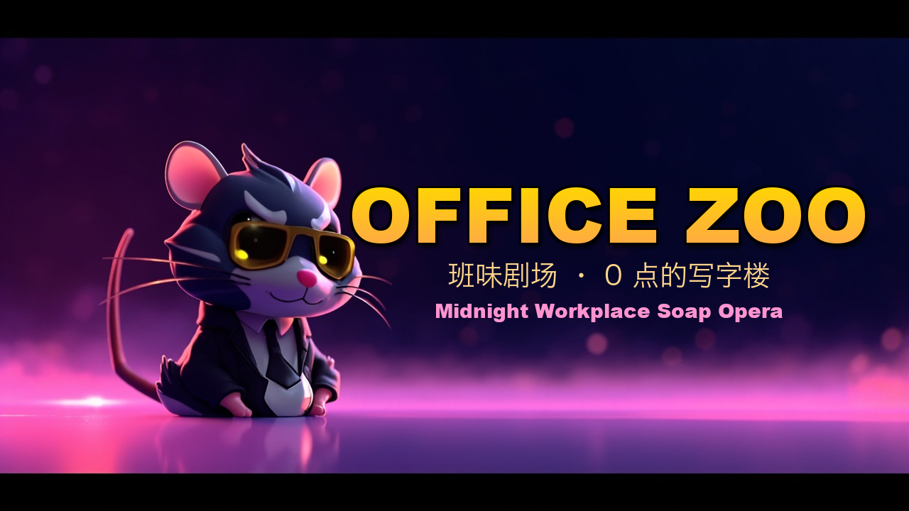

### 0 点的写字楼,AI 鼠人替你拥抱变化,你回家躺平。

[](LICENSE)
[](https://vitejs.dev/)
[](https://hono.dev/)
[](https://www.minimaxi.com/)

**一家公司被裁了,9 名 AI 员工还在加班。**
**你是那只盯着 KPI 屏的 HR — 选个模式,把这一天笑着过完。**

**简体中文** · [English](README.en.md) · [📱 微信小程序](packages/miniprogram/)

</div>

---

## 💡 这是什么

> 一个 AI 自演的"班味剧场" — 不是工具, 是给打工人写的一封降压情书.

| | |
|---|---|
| **核心体验** | 9 个有 personality 的 AI 鼠人在写字楼里自演职场众生相, 你 0 操作就看戏 |
| **目标用户** | 想下班 / 想笑着上班 / 想看着别人替自己崩溃的当代打工人 |
| **不是什么** | 不是工具 · 不是 SaaS · 不是 ROI · 是娱乐 |
| **MVP 周期** | 40+ 轮迭代 (v6.0 → v6.42), 每轮 1-7 个 P, 171 个 vitest 全绿 |
| **License** | MIT · fork 改装搞自家版本 (银行版 / 国企版 / 大厂版) |

## 🎯 凭什么花你 3 分钟

| 痛点 | 我们给的 |
|---|---|
| **班味重** | 4 模式自由切, 看戏不动手, 通勤路上看完一局 |
| **职场黑话疲劳** | 把"颗粒度"做成 AI 自己念到秃, 用幽默消解攻击性 |
| **没人能讲** | 深夜酒馆 1v1 跟某只 AI 鼠人喝酒吐槽, lo-fi BGM |
| **想笑着学劳动法** | 截了么 5 关闯关, 每关绑《劳动合同法》一条 |
| **想把同事搬进游戏** | 公司主题包: 自定义"我们公司 12 个 NPC", 同事点链接开同一局 |
| **想看大模型在演什么** | 全程透明 prompt 设计, 40+ 轮迭代日志在 [CHANGELOG.md](docs/CHANGELOG.md) |

<p align="center">
  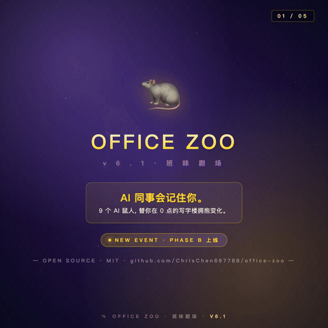
  <br/>
  <em>v6.2 · 米哈游风故事板 + 真实游戏画面合成 30s · <a href="assets/launch-demo/demo-memory.gif">纯故事板版</a> · <a href="assets/launch-demo/game-highlight.gif">纯真实游戏版</a> · <a href="docs/V6_MEMORY_TECH_BLOG.md">技术博客</a></em>
</p>

---

> "卷不动也别躺平 — 让 AI 替你卷,你回家躺平,顺便把段子发朋友圈。"

## 四种打开方式 — 总有一种解你今天的压

| | 模式 | 一句话 | 何时玩 |
|---|---|---|---|
| 🏢 | **鼠人公司** (classic) | 2.5D 写字楼, 9 名 AI 鼠人自演职场众生相 | 想看戏 · 通勤路上 |
| 🎬 | **全程开麦** (immersive) | 全屏沉浸 · 真人 TTS · 8 个声音轮番阴阳 | 想下饭 · 午休前 |
| ⚖️ | **裁了么** (fired) | 1v1 跟 HR 见招拆招 · 5 关速通《劳动合同法》 | 想长本事 · 真要离职时学防身 |
| 🍺 | **深夜酒馆** (bar, v6.2 新) | 凌晨 2 点 · lo-fi · 跟某个 AI 1v1 喝酒互相吐槽班味 | 卷不动了 · 没人能讲时 |

**还有副玩法:** 🔮 班味占卜 daily · 🎤 班味单口 · 🤝 攒局攒朋友 · 📜 7 天历史 · 🃏 牌库 24 卡 · ⭐ **段子 UGC 投稿** (v6.1 新) · 🍷 **朋友拼版彩蛋** (v6.1 新) · 📊 **周报生成器 4 风格** (v6.5 新) · 🏢 **公司主题包** (v6.37 新) · 🎁 **班味年终 Wrapped** (v6.39 新)

---

## 🏗️ 系统架构

> 数据沿虚线流动 —— 下面三张图是**会动的 SVG**(金色光点 = 数据包实时走向, GitHub 自动播放,无需 JS)。

**系统架构** · 观众端 → 服务器 → 引擎 → 智能体 → 大模型,Socket.IO 实时广播回客户端

<p align="center">
  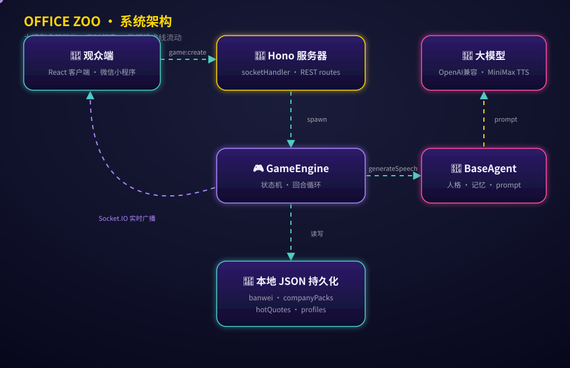
</p>

**PSYWAR 心理战闭环** · 观众战术 @ → AI 听到 → AI 引用 → 班味指数 +6(时序图)

<p align="center">
  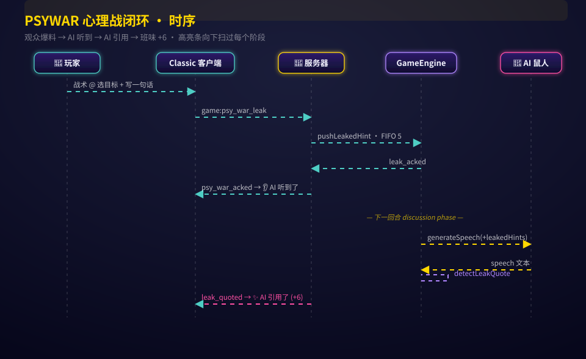
</p>

**公司主题包数据闭环** · 建包 → 持久化 → 分享 → 同事开局 → 名单覆盖 → 班味打卡 → 排行榜 → 本公司 Top

<p align="center">
  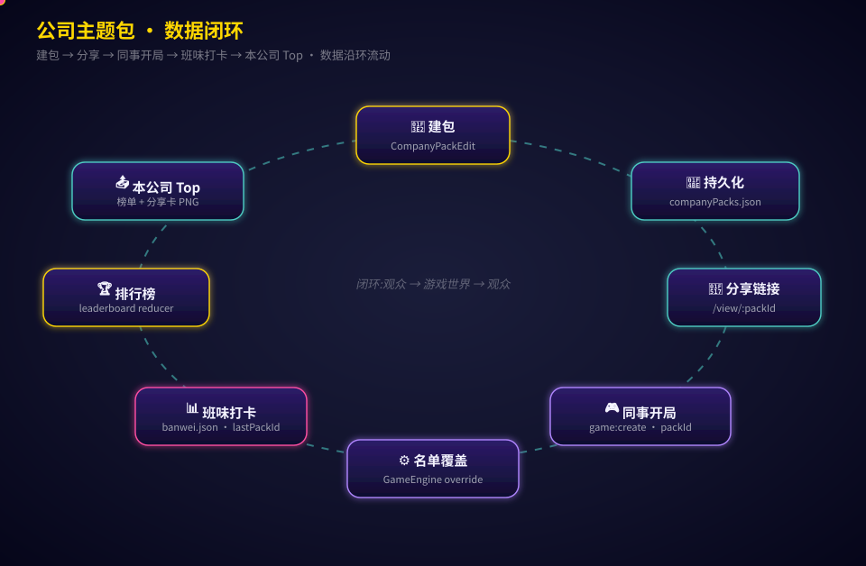
</p>

---

## 🌟 v6.37 → v6.42 升级 · 把同事搬进游戏

> 公司主题包 + 跨观众排行榜 + 班味年终回顾 —— 让"班味"从个人体验长成社交闭环。

- 🏢 **公司主题包** (v6.37→v6.41) — 自定义"我们公司的 6-12 个 NPC"(名字 + 岗位 + 人格 + emoji 头像),存成私有包。分享链接给同事 → 大家点同一个 `?pack=` 开同一局 → AI 鼠人就用你们的名字斗智斗勇,GameMap / 裁员剧场 / 复盘全程显示自定义头像
- 🏆 **跨观众排行榜** (v6.36→v6.38) — 全网 Top 10 班味分公开榜 + 按地区/行业筛选 + "🏢 只看本公司同事 Top",一键下载 1080×1350 榜单分享卡
- 🎁 **班味年终 Wrapped** (v6.39→v6.40) — Spotify-Wrapped 风年度回顾:峰值周 / 平均分 / 趋势 / 爆料命中率 / 成就墙 / 年度班味人格标签,一键导出海报
- 🔥 **班味金句池 → 游戏世界回路** (v6.33→v6.36) — 观众投稿职场金句 → 提名计数加权 → 下一局 AI 鼠人更可能"出场"被提名的名字, GameMap 给热门鼠人加 🔥 badge
- 🧪 **质量** — 426 vitest 全绿 · typecheck 干净 · Playwright 视觉探针验证 wrapped 卡 + 动画架构图

## 🌟 v6.1 升级 (2026-05-22)

> 米哈游风画面 + Z 世代趣味玩法 + 朋友共创闭环

- 🎮 **米哈游风视觉系统** — 深紫宇宙底 + 5★ 金边角色卡 + 元素 chip + EVENT pill, 整个 hero 区做成"新版本上线公告"页, 视觉接近《原神》/《崩坏》活动 banner
- 🎤 **段子库 UGC 共创** (`/talkshow/ugc`) — 任何人都能投稿自己的职场段子, auto-moderation 后等审核, 通过的进入 ★ 本月精选池, 朋友帮你点赞, 月底 Top 5 上首页轮播
- 🍷 **朋友拼版彩蛋** — 在 🍺 深夜酒馆跟某 AI 聊完, 一键创建"拼版", 把链接发给朋友 → 朋友也跟同一个 AI 聊几句 → 后端把你们的金句合并 → 生成"群像截图", 形成多人共享 AI 视角的群体记忆
- 🛡️ **审稿守则极克制** — 黑名单只覆盖直接公司点名 / 政治 / 色情 / 暴力; 调侃 HR 婉辞 ("拥抱变化" / "毕业" / "颗粒度") 全部允许 — 那本来就是产品调性

## ✨ v2.x → v3.0 新功能(2026 年 5 月)

> 让"班味"成为一个可演化、可分享、可二刷的身份系统。

- 🪪 **24 种打工人 archetype** (v2.0.0) — 国企铁饭碗 / 大厂螺丝钉 / 创业老炮 / 金融体面人 / 教培劫余 / 网红打工人 / 北漂 / 沪漂 / 深漂搞钱党 / 杭州互联网青年 / 成都摆烂派 / 海外润人 + 原 v1.3 的 12 种行为型
- 🌀 **班味会演化** (v1.5.1 + v2.0.1 + v2.0.2) — 玩裁员 / 攒局 / 写段子 / 闯关包,每次都给 trait 向量加 delta;漂得够多 archetype 会"转世"(原 sass-master 卷成 grinder),触发"🌀 你已演化为新人格"大字幕
- 🎬 **今日剧情结果分享卡** (v1.5.0) — 1080×1350 IG 竖图 PNG,一键复制或下载;teaser 模式 + 战绩模式两种排版,把每天的剧情塞进朋友圈
- 🏢 **Tribe-aware 推荐** (v2.1.0 + v2.3.0) — 你是大厂?今日剧情自动推 FAANG 剧本 + 大厂段子;你是沪漂?给你推《陆家嘴的早 7 点》;你是杭州的?给你推《我的花名叫"无忌"》
- 🎭 **化学反应导演** (v3.0.0) — 攒局时 AI 编剧会看全队 archetype 混合,自动写出"国企 + 大厂 = 文化冲突剧"、"全员北漂 = 群像剧"、"卷王 vs 摆烂 = 天敌同台" — 不再是模板剧本,每桌都是独家剧情
- 🎙️ **Per-beat 多声音** (v1.4.2) — squad 剧本每个角色用自己的 archetype 专属音色播报,御姐 / 霸道总裁 / 青涩男切换无缝
- 🌐 **i18n 覆盖新 12 archetype** (v2.2.0) — 简中 / English / 日本語 / 한국어 四语,Profile 卡完整本地化

## 它会做什么

- 🗣️ **真·职场黑话** — "@同学 你这个事情 owner 是谁?颗粒度不够,先对齐一下底层逻辑"
- 🔪 **暗中"优化"同事** — 资本家每轮挑一名打工人"毕业",走 N+1 流程, 全程不沾血
- 🗳️ **复盘 + 投票** — 8 名鼠人围圈开会,真人语音轮番阴阳,投票把 0 点的锅甩出去
- 👻 **离场前的最后一击** — 被裁的人靠"劳动仲裁票"扳回一城, 离职信仰永不毕业

## 凭什么 Star?

- 🎨 **35+ AI 立绘 + 23 角色头像** — 全是程序生成的二次元,0 张 emoji 凑数
- 🎙️ **23 个角色专属音色** — 青涩男 / 御姐 / 霸道总裁 / PUA 大师,听完一回合像追了一集职场短剧
- 📚 **真法条教学** — 每关一条《劳动合同法》,通关解锁知识卡片(21/35/41/42/50 条)
- ⚡ **多层降级** — 三层 LLM、四层 TTS、五层图像生成,断哪一层都不哑火
- 🏗️ **代码全开源** — MIT 协议,fork 改装搞自家版本(996 IT 公司版 / 银行金融版 / 国企版)

## 📸 截图

> 每次发版会同步真机截图到 `assets/screenshots/`,见 [`docs/RELEASE_PROCESS.md`](./docs/RELEASE_PROCESS.md) 流程。

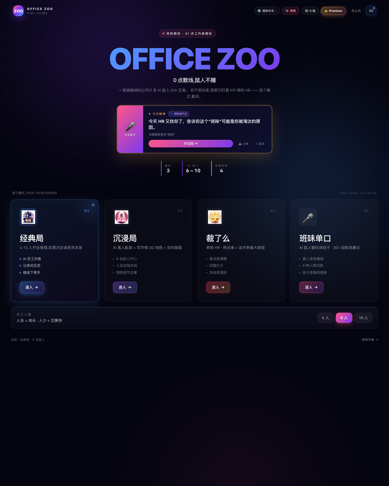

| 🏢 经典模式 · 2.5D 写字楼 | 🎬 沉浸模式 · 真人语音圆桌 |
|:---:|:---:|
| 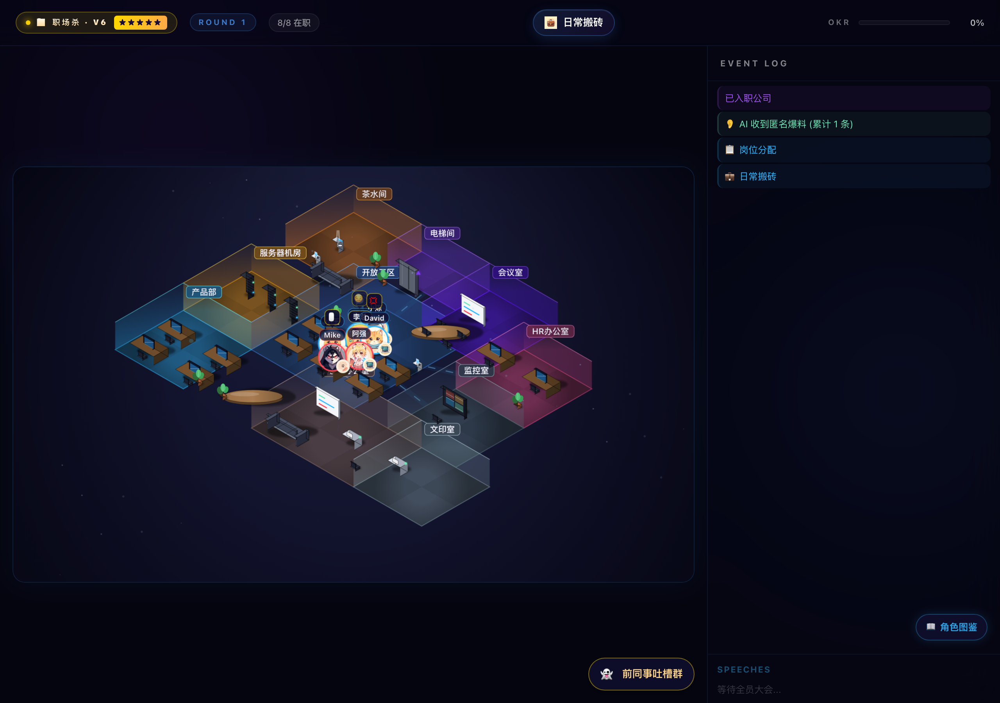 | 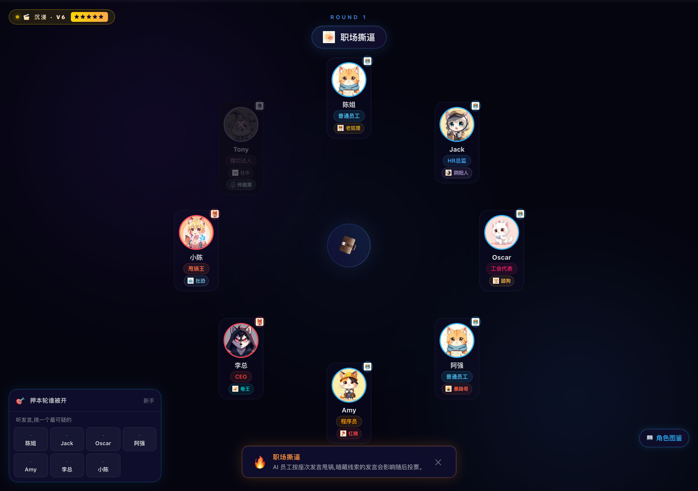 |
| **⚖️ 裁了么 · 5 关闯关** | **🎤 班味单口 · 段子库** |
| 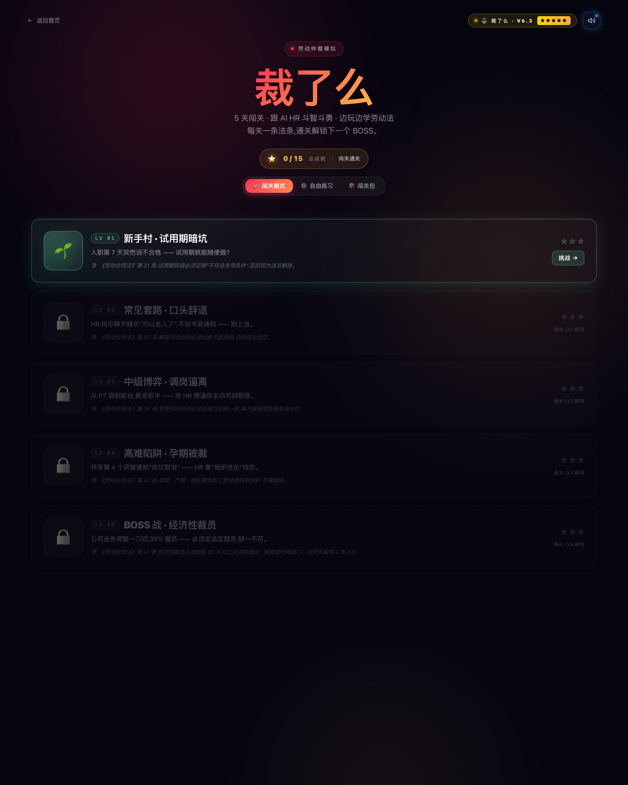 | 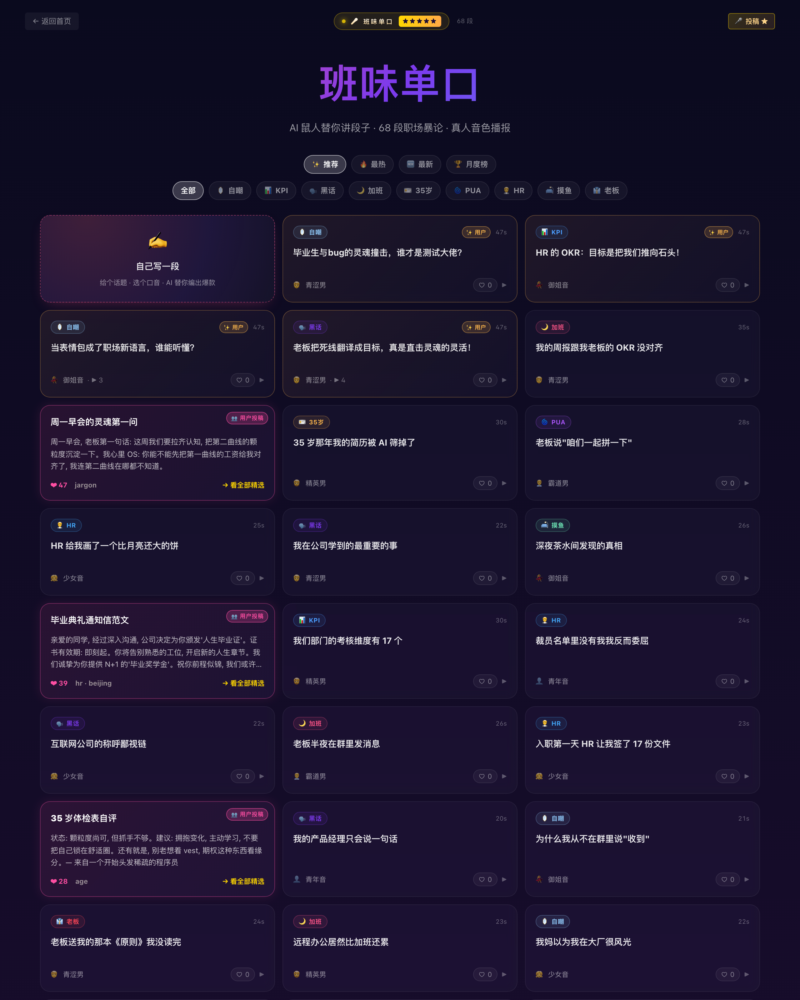 |
| **🎁 班味年终 Wrapped 海报** | **🪪 你是哪种打工人 · 班味卡** |
| 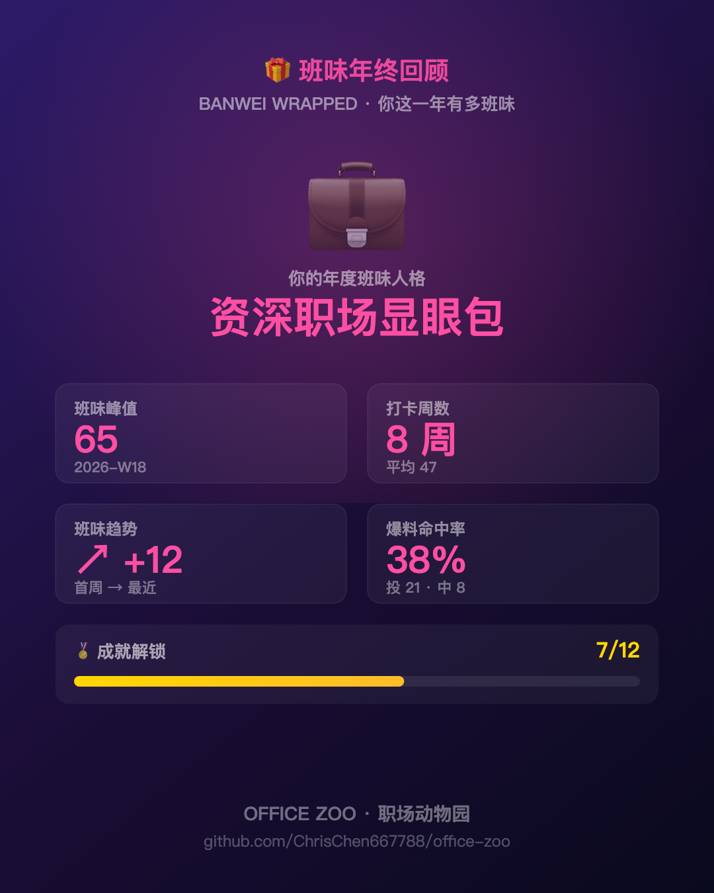 | 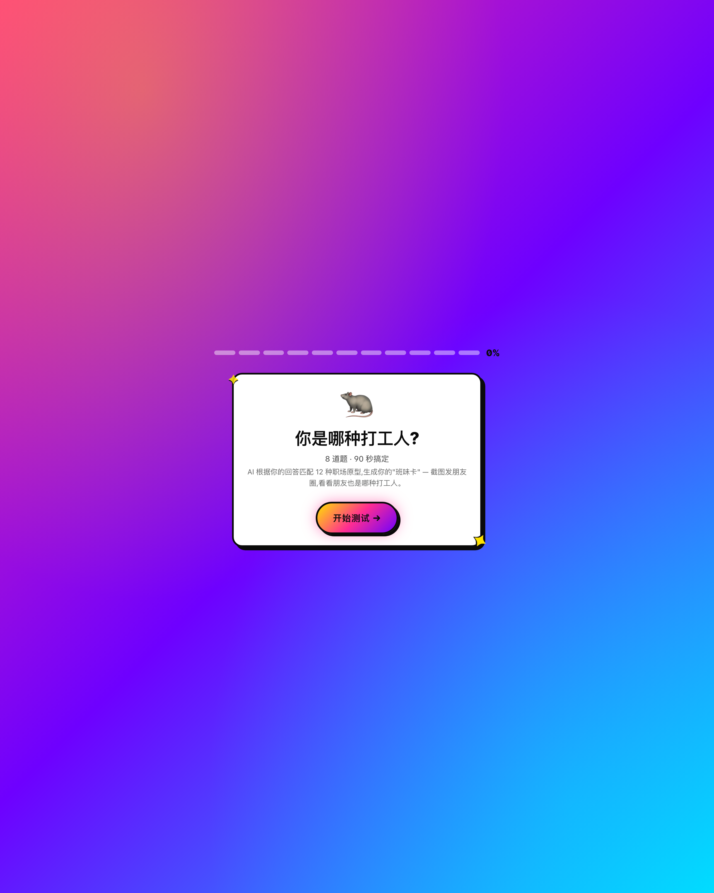 |

> 截图由 `npm run gen:screenshots`(静态路由 + 活的游戏局,Playwright 真机抓取)刷新,需先 `npm run dev` 起本地服务。

## 30 秒跑起来

```bash
git clone https://github.com/ChrisChen667788/office-zoo.git
cd office-zoo

npm install                  # 装依赖

cp .env.example .env         # 改成你自己的 key
# 必填:
#   QINGYUN_API_KEY=<你的青云聚合 key>      # OpenAI 兼容,推荐
#   MINIMAX_API_KEY=<你的 Minimax key>      # 真人 TTS + LLM + 图像

npm run dev                  # 起 Vite + Hono + WS
open http://localhost:5173
```

> 首次启动会跑 5-10 分钟生成 23 个角色立绘 + 35 个图标(后续秒开)。
> 没有 key 也能跑 — 浏览器 Web Speech 兜底,emoji 占位,核心玩法不残缺。

## 资产管理

```bash
# 全量重生角色立绘
npx tsx packages/server/src/scripts/regen-avatars.ts

# 全量重生 UI 图标
npx tsx packages/server/src/scripts/regen-icons.ts

# 只重生指定 key
npx tsx packages/server/src/scripts/regen-icons.ts mode_classic team_cat
```

## 核心特性深挖

### 1. AI 发言不像 ChatGPT

`BaseAgent.ts` 的 system prompt 不是简单"发表你的看法",而是 9 条硬规则:

```
1. 必须满满阿里味儿 — 叫人必须用"同学"或"@同学"
2. 必须使用 3 个以上职场黑话 — 赋能/拉通/对齐/打透/沉淀/闭环 ...
3. 立场鲜明 — 必须明确说出你怀疑谁/想投谁
4. 8 种人格切换 — 社牛/社恐/杠精/暴躁/老狐狸/卷王/舔狗/阴阳人
5. 开口即炸 — 第一个字就要是攻击或阴阳,别铺垫
... + 后处理 sanitizeSpeech() 自动剥离 LLM 偶尔加的元注释
```

### 2. 自由活动 Tick 系统

服务端 `runFreeRoam()` 是 6 tick × 1.5s 的循环:
- 30%/tick 概率:settled 玩家挑新房间发起 commute
- `pathProgress` 0→1 在 ~3 ticks 内走完一条走廊
- 每 tick 推送 `'tick'` 事件,客户端 60 fps lerp

客户端 `GameMap.tsx`:
- 房间间移动用 **Catmull-Rom 样条**走出弧形,不直线瞬移
- 当前发言者头像 1.18× 放大 + 房间脉冲光晕
- 8 种 activity 图标(打字/咖啡/偷瞄/印纸 ...)在玩家右下徽章

### 3. 裁了么 — 5 关 × 真法条

| LV | 场景 | HR | 法条 |
|---|---|---|---|
| 🌱 1 | 试用期突然裁员 | 菜鸟 | 第 21 条 |
| 🎯 2 | 口头辞退不给书面 | 菜鸟 | 第 50 条 |
| ⚖️ 3 | 调岗降薪逼自离 | 老油条 | 第 35 条 |
| 👶 4 | 孕期被裁 | 老油条 | 第 42 条 |
| 👹 5 | 经济性裁员违法 | 魔鬼 | 第 41 条 |

每关结算根据 `compensationMonths / maxPossible` 算 1-3 ⭐,通关解锁下一关 + 弹"知识卡片"。
进度持久化到 `localStorage`(`office-zoo.fired-progress`)。

### 4. 公司主题包 — 把你和同事搬进游戏

- 在 `/company-pack/edit` 定义 6-12 个 NPC:名字 + 岗位(软偏向阵营) + 人格 + emoji 头像
- 服务端 atomic-rename 持久化(`companyPacks.json`),每用户 5 包上限,可删除腾位
- 分享 `/company-pack/view/:packId` 链接 → 同事点 "🎮 直接开局" → `?pack=` 自动选包 → `GameEngine.createPlayers` 整 NPC 元组一起 shuffle(名字↔人格↔头像对齐),用你们的名字开局
- 同包同事自动归到 "🏢 本公司 Top" 排行榜,一键下载榜单分享卡

## Roadmap

> 完整版见 [`docs/CHANGELOG.md`](docs/CHANGELOG.md) — 含所有版本的"why / what / verified"原文。

**已上线(2025-12 → 2026-05):**
- ✅ **v0.6-v0.9** 2.5D 写字楼 + tick 循环 + 8 种 activity / talkshow + Web Speech 兜底 / UGC + HR 记忆 + 闯关包 + PvP 房间
- ✅ **v1.0** Premium 6 个 FAANG 场景 + 付费墙 demo
- ✅ **v1.1** B 端白标 + HR 培训沙盒 + 高管金属主题
- ✅ **v1.2** i18n 中/英/日/韩
- ✅ **v1.3** "你是哪种打工人"identity quiz + 12 archetype + Y2K 班味卡 + archetype-personalized 推荐
- ✅ **v1.4** 攒局模式 + 多声音 + 历史/排行
- ✅ **v1.5** 今日剧情结果分享卡 + archetype 演化(单 surface)
- ✅ **v2.0.0** 12→24 archetype + region/industry 维度
- ✅ **v2.0.1 + v2.0.2** 演化扩到 squad / talkshow / pack 三个 surface
- ✅ **v2.1** Tribe-aware fired 推荐 + FiredLanding tribe 过滤
- ✅ **v2.2** 新 12 archetype 的 en/ja/ko 翻译
- ✅ **v2.3** Talkshow 加 region tag + daily 推 城市段子
- ✅ **v3.0** 化学反应导演 — squad 编剧看全队 archetype mix 写专属剧
- ✅ **v6.25-v6.36** PSYWAR 心理战 + 班味指数 / 金句池 / 周报 / 排行榜 + 小程序端
- ✅ **v6.37-v6.42** 公司主题包(私有 NPC deploy)+ 跨观众排行榜 + 班味年终 Wrapped + 动画架构图
- ✅ **v6.51** 真 Stripe Checkout(替换 v1.0 demo)+ Squad 导演 Sonnet A/B + 公司包跨局剧情记忆 + Wrapped 邮件订阅
- ✅ **v6.52** 核心角色技能落地(HR总监查身份 / 工会代表保护,AI 会用)+ 核心对局循环测试覆盖
- ✅ **v6.53** 法务顾问替身挡刀 + 数据分析师查 OKR 产出泄底 —— 会上场的特殊角色技能全部接入
- ✅ **v6.54** 🎬 对局回放(服务端持久化 + 事件时间线回放页 + 深链分享;Premium 回放权益上线)
- ✅ **v6.56** 内审专员(夜审已离职员工 → 查其阵营)+ 销售冠军(夜追在世玩家 → 报其行踪/同房)接技能 + 11/12 人 preset 轮换 —— 定义过的打工人角色全部能上场
- 🧩 **v6.57** 「裁了么」闯关牌局(方案 A)**数值核心**落地:话术卡 × HR 姿态克制矩阵 + 双血条(底气/筹码 vs 预算/耐心)+ 赔偿阶梯(N+1→2N→3N)+ 见好就收/掀桌抽取风险 —— 纯函数 + 21 vitest 锁死(`shared/negotiation/`)
- ✅ **v6.58** 闯关牌局**可玩了**:客户端牌局 UI(手牌 / 双血条 / 赔偿阶梯 / 掀桌终局,`/fired/battle`)+ 每次出牌 HR 台词接 `FIRED_HR_MODEL` **实时演**(数值定结果 · LLM 配台词 · 断网兜底)+ FiredLanding 入口;纯 chat 谈判保留为「简单模式」并存

- ✅ **v6.59** 牌局**方案 B 局间成长 + C 职场遗物**:打完给经验/遣散费 → 升职级(实习生→老油条→维权斗士→劳动法之神)解锁**进阶卡**(仲裁威胁/媒体曝光)+ **更狠的 BOSS**(HR专员→HRD→CEO);开局可带**一次性遗物**(工会卡/录音笔/大厂offer/赔偿计算器)改写规则。进度 localStorage 持久化

- ✅ **v6.60 → v6.62** 深层界面图标 emoji→AI **全部完成**:9 张 nav 图标(首页二级入口 + 占卜/单口/周报/裁了么/Premium/酒馆/测试/攒局/周年/我的)+ 14 张牌局 UI 小图(预算/耐心/底气/筹码 + 10 张话术卡);全部 `<Icon>` 带 emoji 兜底

- ✅ **v6.63** 闯关牌局上**牌库抽牌**:从牌库抽 5 张起手 · 打牌进弃牌堆 · 回合末弃手重抽 · 牌库空了洗弃牌堆回来(纯引擎 `deck.ts` + 12 测试)—— roguelike 牌库感
- ✅ **v6.64** 牌局**局间商店**:攒的遣散费买遗物(永久拥有 + 装备)· 卡牌**复制 / 升级**(deck-building,升级版 `id+` 力度 +6)· 持久化(纯引擎 `shop.ts` + 10 测试)
- ✅ **v6.65** 闯关线**收口**:打完一键出 1080×1350 **赔偿结算战绩卡**(对手 / 赔偿档 / 遗物 / 回合 / 收获 / 职级 + 一句嘴替,赢绿平黄输红)· 系统分享 / 下载(纯文案 `shareCard.ts` + 7 测试 + client canvas)
- ✅ **v6.66** 闯关**三件套**:**全网战绩榜**(打完上报、按 userId 留个人最佳、准备界面 🏆 面板每行可 📸 重画战绩卡)+ **第 4 档 BOSS「🐉 资本本尊」**(满级专属,赔率 ×3.6)+ **牌局反哺主对局**(主局任一只鼠被裁,旁观席「⚔️ 谈赔偿」跳进牌局替 TA 谈)· 纯引擎 `leaderboard.ts` / `bridge.ts` + server `negRunStore` + 17 测试
- ✅ **v6.67** 经典局**演出强化**:被优化角色「**表情立绘弹出**」(角色大头 + 刀/票角标 + 😵/😭 表情贴纸 + 斜盖「已优化」印章,弹跳+抖动)+ 聊天框「**群众表情包吐槽**」(谁被裁/出局/爆料,EVENT LOG 紧跟一条粉色吃瓜弹幕)· 纯池 `data/reactions.ts` + 7 测试
- ✅ **v6.68** 群众吐槽「**弹幕飘地图**」(`ReactionDanmaku`:被裁/出局时从右往左飘一串粉色吐槽 pill,分车道错时延,几秒自清)+ **沉浸局演出对齐**(沉浸局也接弹幕;立绘头像两端一致)
- ✅ **v6.69** 裁员演出**全面升级**:立绘接 **AI 表情图**(惊恐×3/委屈×3,doubao 生成,emoji 兜底)+ 群众吐槽接 **LLM 实时生成**(结合谁/身份/性格,`/api/reaction/line` + FIRED_HR_MODEL,静态池兜底)+ 弹幕**从被裁工位飘出**(`GameMap.onPositions` 节流上报坐标 → `ReactionDanmaku.origin` 上飘)
- ✅ **v6.70** 演出**收尾三连**:群众吐槽接 **TTS 念出来**(经典局,吃瓜路人音,静音可关)+ 立绘进 **HighlightReel 复盘**时间线(惊恐/委屈缩略图)+ 立绘**出场音效**(`sfx.playReveal`:惊恐"啊!"/委屈呜咽,叠在 kill/vote 主音上)
- ✅ **v6.71** 打磨:表情立绘**烤进导出的战报 PNG**(`shareCard` 复盘行尽力预加载立绘 + 圆角 `drawImage`,超时/失败回退 emoji,不污染 canvas)—— 复盘屏幕 + 分享卡两端都有立绘
- ✅ **v6.72** 打磨:**立绘去重**(AI 图加载到就隐藏冗余 😵/😭 贴纸,`Icon.onResolved`)+ **群众吐槽降噪**(每次裁员只 1 条弹幕/日志,LLM 到了按 `groupId` 替换静态而非叠加)
- ✅ **v6.73** 爆款①·短视频:**名场面识别升级**(`highlightPicker` 新增 反转/完美伪装/绝地翻盘/腥风血雨 4 种高戏剧性名场面,接 `predictionLog`,基础分压过普通击杀,+8 测试)+ 帧标签/字幕/分享文案补新 kind + 系统分享挂 # 话题(竖版 9:16/LLM 字幕/mp4 转码 v0.3–0.4 已有)
- ✅ **v6.74** 爆款②·下注:旁观局 `PredictionBar` → **观众下注盘 `BettingBar`**(筹码/赔率/派彩,押中按锁定赔率结算,每日补给+破产兜底,纯引擎 `betting/betting.ts` +11 测试)+ **全网战绩榜「赌怪榜」**(💰 筹码榜 / 🎯 神算榜带样本门槛,纯排序 `betting/leaderboard.ts` +8 测试 + 服务端 `bettingStore` mirror 落盘 + `/api/betting/*`);仍写 `predictionLog` 不破坏 HighlightReel/名场面
- ✅ **v6.75** 爆款③·关系:**AI 记忆关系网**(鼠人跨局记仇/记恩)—— 纯引擎 `memory/relationships.ts`(archetype 持久身份键的有向情绪图,投票把我投出=记仇、同阵营投我=叛变记大仇、救我=记恩,+13 测试)+ 服务端 `relationStore`(串行写队列)+ GameEngine round-end ingest + `/api/relations` + **🕸️ 恩怨录关系图谱 UI**(红线结仇/绿线交情/箭头指向被记的那只)+ `BaseAgent` 发言注入旧账让 AI 甩「上次你卖过我」;跟 pgvector 情景记忆流互补(那层 episodic,这层结构化社交图谱)

**下一步(开放讨论):**
- [x] ~~赔偿结算分享卡~~ —— v6.65 已上(战绩图 boss / 赔偿档 / 遗物 / 回合数,一键分享)
- [x] ~~牌局打磨:抽牌/手牌上限 · 遗物多选 + 商店 · 赔偿阶梯结算分享卡~~ —— v6.63→v6.65 全部落地
- [ ] Premium 高级音色 —— 需 voice-clone 基建(商业化向,暂缓)
- [ ] Premium 律师入口 —— "真人咨询"是线下服务非纯代码(商业化向,暂缓)

## 安全须知

- `.env` 已 gitignore,**永远不要 commit 真实 key**
- 自己 fork 后请用自己的 API key
- 如果发现历史 commit 误传过 key,立即在对应平台 rotate

## 贡献

纯娱乐项目,核心价值是当代打工人苦中作乐的精神状态。

- 🐛 Bug → issue
- 🎨 想加新模式 / 新角色 / 新场景 → PR
- 💡 想加新人格(eg "00 后整顿职场") → `personality.ts` 加一行
- 🎙️ 想替换音色 → fork 一份用自家 voice clone

**起 star ≠ 帮我,起 star = 让算法把这个项目推给更多打工人。**

### git hooks(可选)

仓库带一个**不拦截**的 pre-push 钩子:push 前用 `git-cliff` 列出
还没写进 [`docs/CHANGELOG.md`](docs/CHANGELOG.md) 的提交,提醒你补一句版本日志
(只 nag,push 照常进行)。一键安装:

```bash
npm run hooks:install        # 把 scripts/git-hooks/* 拷进 .git/hooks/
```

想临时静默(比如纯文档提交):

```bash
OFFICE_ZOO_SKIP_CHANGELOG_NUDGE=1 git push
```

## 🙏 致谢

OFFICE ZOO 站在一整套开源 AI 与 Web 生态的肩膀上,特此致谢:

**大模型与推理**
- [MiniMax](https://www.minimaxi.com/) — `speech-2.8-hd` 真人 TTS / `MiniMax-M2` 文本 / `image-01` 立绘
- [通义千问 Qwen](https://github.com/QwenLM/Qwen) / [青云聚合 (QingYunTop)](https://api.qingyuntop.top/) — 国产大模型推理后端 + OpenAI 兼容多模型路由
- [OpenAI API 规范](https://platform.openai.com/docs/api-reference) — 全项目以 OpenAI 兼容协议接入,可无缝切换后端
- 多智能体 social-deduction 架构(每鼠人独立人格 + 记忆 + prompt patch),灵感来自 LLM-as-Agent / Generative Agents 一系研究

**后端 · 前端 · 工具链**
- [Hono](https://hono.dev/) + [Socket.IO](https://socket.io/) — 轻量 Web 框架 + 实时广播/断线重连
- [React](https://react.dev/) + [Vite](https://vitejs.dev/) + [Zustand](https://github.com/pmndrs/zustand) + [Framer Motion](https://www.framer.com/motion/) — 前端框架 / 原子状态 / 动画
- [glass-easel](https://github.com/wechat-miniprogram/glass-easel) — 微信小程序运行时
- [Vitest](https://vitest.dev/) + [Playwright](https://playwright.dev/) + [git-cliff](https://github.com/orhun/git-cliff) — 单测 / 视觉探针 / CHANGELOG 自动化

**灵感来源**
- *Among Us* / 狼人杀 / 谁是卧底 —— social deduction 玩法母体
- 真实职场里每一个"拥抱变化"的瞬间 —— 班味之源 · 所有为打工人发声的人

## ⭐ Star History

如果这个项目让你会心一笑,欢迎点一个 Star。

[](https://www.star-history.com/#ChrisChen667788/office-zoo&Date)

## License

MIT — 拿去随便玩。fork 出商业版,请别忘了打工人。

---

<div align="center">

**🌟 Star 一下,精神工位 +1,班味 -1。**

[⬆ 回到顶部](#-office-zoo)

</div>
