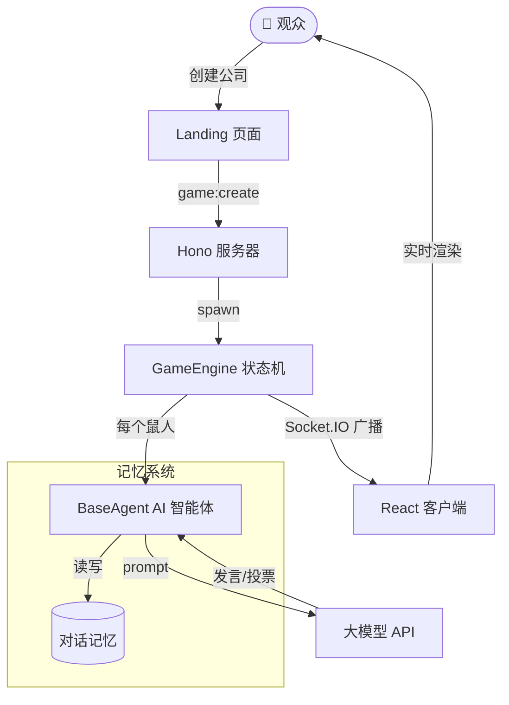

# 🐀 OFFICE ZOO · 职场动物园

> AI 鼠人替你在职场里斗智斗勇 —— 一个用大模型驱动的中文职场 social deduction 游戏。

[](https://github.com/ChrisChen667788/office-zoo/actions/workflows/smoke.yml)

**OFFICE ZOO**（职场动物园）是一个 AI 驱动的中文职场推理游戏：你创建一个"公司"，AI 鼠人员工们在工位、茶水间、会议室里摸鱼、甩锅、站队、表演忠诚，而你要找出谁是"卧底"。

---

## ✨ 这是什么

| 维度 | 说明 |
|------|------|
| 🎭 **核心玩法** | AI 鼠人自主对话 + 投票淘汰，你扮演"看戏的人事总监" |
| 🧠 **AI 驱动** | 每个鼠人有独立人格、记忆、说话风格，发言由大模型实时生成 |
| 🗺️ **职场地图** | 工位/茶水间/会议室/老板办公室，鼠人实时走动 + 摸鱼 |
| 🔥 **班味系统** | 班味指数 / 金句池 / 周报 / 排行榜，把"打工人共鸣"做成可量化的分数 |
| 🏢 **公司主题包** | 自定义"我们公司的 12 个 NPC"，私有部署你的职场宇宙 |

---

## 🚀 快速开始

```bash
# 1. 安装依赖（pnpm workspace）
pnpm install

# 2. 配置后端环境变量（OpenAI 兼容 API）
cp packages/server/.env.example packages/server/.env
# 编辑 .env，填入 OPENAI_API_KEY / BASE_URL / MODEL

# 3. 启动开发环境（server :3100 + client :5173）
pnpm dev
```

> 需要 Node 18+。默认使用 OpenAI 兼容接口，可对接 Minimax / Qingyun / 通义 等国内大模型。

---

## 🎮 游戏模式

| 模式 | 路由 | 说明 |
|------|------|------|
| 经典局 | `/classic/:id` | 8 鼠人标准局，AI 自主发言 + 投票 |
| 沉浸式 | `/immersive/:id` | 第一视角，你作为鼠人参与 |
| 解雇模拟 | `/fired` | 1v1 你 vs AI-HR，比拼嘴硬 |
| 脱口秀 | `/talkshow` | AI 鼠人脱口秀专场 |
| 班味占卜 | `/fortune` | 每日职场塔罗 |
| 周报生成 | `/weekly` | 一句话 → 4 种风格周报 |

---

## 🧠 AI 架构



---

## 🛠️ 技术栈

| 层 | 技术 |
|------|------|
| 前端 | React 18 + Vite 6 + Zustand + Framer Motion |
| 后端 | Hono + Socket.IO + Node 18 |
| AI | OpenAI 兼容 API（Minimax/Qingyun/通义）+ 自研 prompt 工程 |
| 小程序 | 微信原生 + glass-easel runtime |
| 测试 | Vitest（161 用例）+ Playwright 视觉探针 |
| 工程 | pnpm workspace + git-cliff CHANGELOG + pre-push hooks |

---

## 📦 项目结构

```
furball-arena/
├─ packages/
│  ├─ client/      React 客户端（游戏 UI + 班味系统）
│  ├─ server/      Hono 服务器（GameEngine + AI Agent）
│  ├─ shared/      共享类型 + 角色/人格定义
│  └─ miniprogram/ 微信小程序端
└─ data/           本地 JSON 持久化
```

---

## 📈 班味系统（v6.x 重点）

OFFICE ZOO 不只是游戏，更是"打工人共鸣"的量化实验：

- **班味指数** — 0-100 周度评分，综合爆料/引用/观赛/段子
- **金句池** — 观众投稿职场金句，AI 鼠人下一局可能引用
- **跨观众排行榜** — 全网 + 公司内部 Top 10，按地区/行业筛选
- **周存档** — 12 周班味曲线 + 历史最佳

---

## 🧪 测试

```bash
pnpm test           # vitest run（161 用例）
pnpm typecheck      # tsc --noEmit
```

---

## 🙏 致谢

OFFICE ZOO 站在一整套开源 AI 与 Web 生态的肩膀上，特此致谢：

**大模型与推理**

- [OpenAI API 规范](https://platform.openai.com/docs/api-reference) — 全项目以 OpenAI 兼容协议接入大模型，可无缝切换后端
- [MiniMax](https://www.minimaxi.com/) — 鼠人发言生成 + speech-2.x TTS 语音合成
- [通义千问 Qwen](https://github.com/QwenLM/Qwen) / [Qingyun](https://api.qingyuntop.top/) — 国产大模型推理后端，低成本高并发
- 多智能体 social-deduction 架构（每个鼠人独立人格 + 记忆 + prompt patch），灵感来自 LLM-as-Agent / Generative Agents 一系研究

**后端与实时**

- [Hono](https://hono.dev/) — 轻量高性能 Web 框架，承载全部 REST 路由
- [Socket.IO](https://socket.io/) — 游戏状态机的实时广播与断线重连
- [Node.js](https://nodejs.org/) — 运行时

**前端与交互**

- [React](https://react.dev/) + [Vite](https://vitejs.dev/) — 前端框架与工程化
- [Zustand](https://github.com/pmndrs/zustand) — 细粒度状态管理（原子 selector 防止全量重渲染）
- [Framer Motion](https://www.framer.com/motion/) — 动画与转场

**小程序与工具链**

- [glass-easel](https://github.com/wechat-miniprogram/glass-easel) — 微信小程序运行时
- [Vitest](https://vitest.dev/) + [Playwright](https://playwright.dev/) — 单测与视觉探针
- [git-cliff](https://github.com/orhun/git-cliff) — CHANGELOG 自动化
- [star-history](https://star-history.com/) — 下方 Star 曲线

**灵感来源**

- *Among Us* / 狼人杀 / 谁是卧底 —— social deduction 玩法母体
- 真实职场里每一个"拥抱变化"的瞬间 —— 班味之源

> OFFICE ZOO 的目标不是做一个玩具 Demo，而是持续探索"大模型多智能体 + 实时叙事"在中文语境下能有多好玩。

---

## ⭐ Star History

如果这个项目让你会心一笑，欢迎点一个 Star。

[](https://www.star-history.com/#ChrisChen667788/office-zoo&Date)

---

## 🤝 贡献与交流

欢迎提 Issue / PR 一起完善 OFFICE ZOO。你可以从这些方向参与：

- 补充更多职场场景 / 人格 / 金句池内容
- 优化 AI prompt 与多智能体策略
- 增强班味系统的数据可视化
- 补充 Docker / 部署文档

---

## 📮 联系方式

- GitHub Issues
- 项目主页：https://github.com/ChrisChen667788/office-zoo

---

（注：项目数据落在本地 `packages/server/data/*.json`，重启即恢复，**无需数据库**。详细部署见 [DEVELOPMENT_PLAN.md](DEVELOPMENT_PLAN.md) 与 [PRD.md](PRD.md)。）
